# Smartly-A Trivia App

# Breif Overview


<table align="center" width="100%" style="background-color:#ffffff;">
<tr>
      <td align="center"></td>
      <td align="center"></td>
      <td align="center"></td>
  </tr>
  </table>

I have tried my best to implement all possible features and backend logic checks. I can do this more better but due to limitation of time I have to submit it as it is.

A Splash Screen, which can handle some server/lazy loading in future.
A welcome screen which will lead to login page and user can login as guest for now. User will be asked to input his/her name and select an avatar from a limited range.
A home page containt setting icon which takes user to settings to control different selective options as mentioned in given task.
Home page also contain a collapsing bar providing a good look. Categories and quick mode is given here which will lead user to question attempt.
On bottom user's previously attempted questions are display.

I didn't add proper comments but I'll add more comments in codes after submission. :)

All the given tasks are implemented successfully. I tried my best to touch every aspect of implementation in a short time with an intuitive UI. I had to design, edit and search for UI component.
Attempted questions are saved locally.
Score is saved category wise and displayed on each category as well as collectively.
User will have 5 seconds for each question and 3 lives in a quiz. after every question a 3 second pause is added to give a good user experience.
Rules are same as mentioned in task.
Quick mode is also implemented. A set of 20 random questions with random type, topic and difficulty level will be queried and once 5 questions are left to attempt further 20 will be queried in background and added in questions' stack.

# Some Known issues/ Improvements

There are some network and UI lifecycle checks which I couldn't implement due to time issues.
I also planned to implement some sounds, to be played on user interaction with app UI.
I can implement animations on views to make it more appealing.
Logout button does clear login session. But it doesn't redirect to login page. That's not a big issue. I can do fix it. On I logout I didnt clear local for testing purpose. DB wipe method can be called to do so.
UI is mostly responsive but I can make more responsive for Tab layouts as well.
Currently it is in English language while I can work on multi-language instructions.

# Gradle Dependencies I used

```
    implementation 'androidx.core:core-ktx:1.3.2'
    implementation 'androidx.appcompat:appcompat:1.2.0'
    implementation 'com.google.android.material:material:1.3.0'
    implementation 'androidx.constraintlayout:constraintlayout:2.0.4'
    implementation 'com.squareup.retrofit2:retrofit:2.8.1'
    implementation('com.squareup.okhttp3:okhttp:4.3.0')
    implementation('com.squareup.okhttp3:logging-interceptor:4.3.0')
    implementation 'com.jakewharton.retrofit:retrofit2-kotlin-coroutines-adapter:0.9.2'
    implementation "com.squareup.retrofit2:converter-gson:2.8.1"
    implementation 'com.github.bumptech.glide:glide:4.11.0'
    annotationProcessor 'com.github.bumptech.glide:compiler:4.11.0'
    implementation "androidx.multidex:multidex:2.0.1"
    implementation 'androidx.vectordrawable:vectordrawable:1.1.0'
    implementation 'androidx.navigation:navigation-fragment:2.3.4'
    implementation 'androidx.navigation:navigation-ui:2.3.4'
    implementation 'androidx.lifecycle:lifecycle-livedata-ktx:2.3.0'
    implementation 'androidx.lifecycle:lifecycle-viewmodel-ktx:2.3.0'
    implementation 'androidx.navigation:navigation-fragment-ktx:2.3.4'
    implementation 'androidx.navigation:navigation-ui-ktx:2.3.4'
    implementation "androidx.room:room-runtime:2.2.6"
    kapt "androidx.room:room-compiler:2.2.6"
    implementation "androidx.room:room-ktx:2.2.6"
    implementation 'com.google.android:flexbox:2.0.1'
    testImplementation "androidx.room:room-testing:2.2.6"
    implementation "com.google.dagger:dagger:2.27"
    kapt "com.google.dagger:dagger-compiler:2.27"
```

# Debug APK

[](./assets/app-debug.apk)

# Some App Screenshots

<table align="center" width="100%" style="background-color:#455A64;">
<tr>
      <td align="center"></td>
      <td align="center"></td>
      <td align="center"></td>
  </tr>
  <tr>
      <td>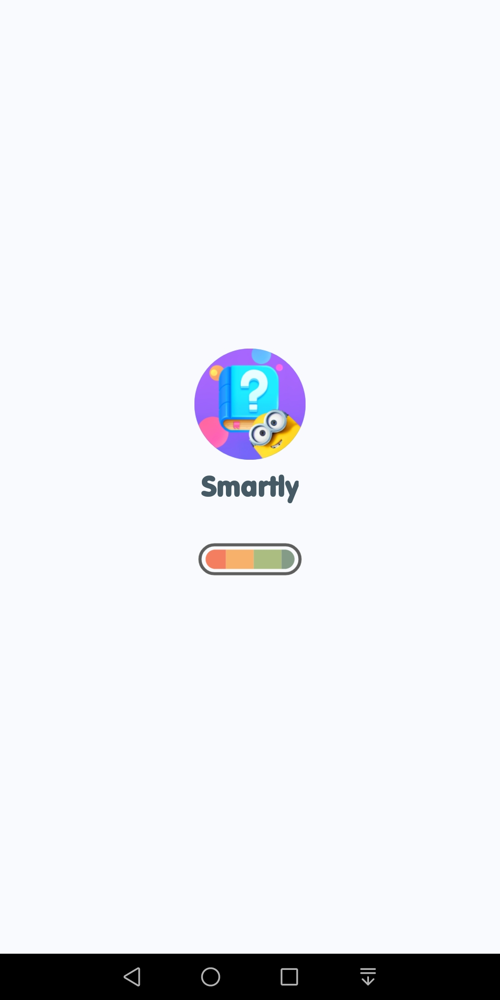</td>
      <td>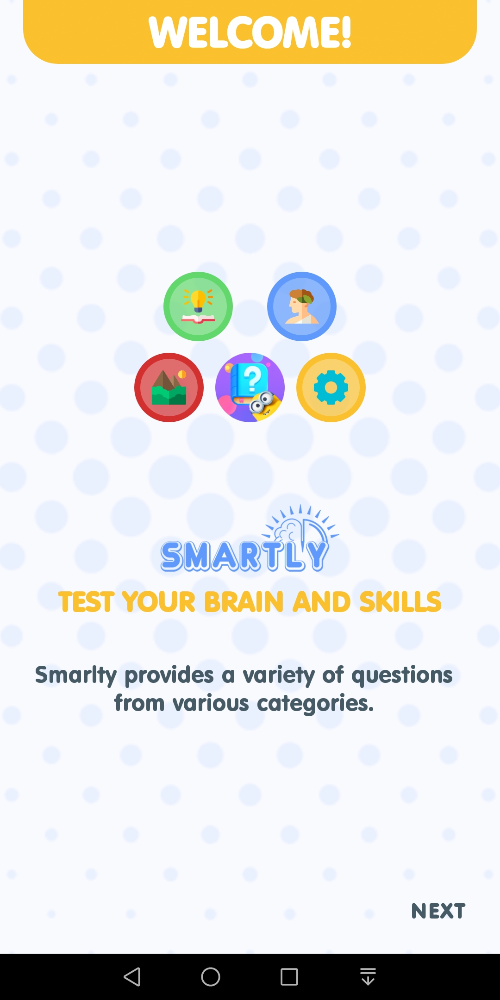</td>
      <td></td>
  </tr>
  <tr>
      <td>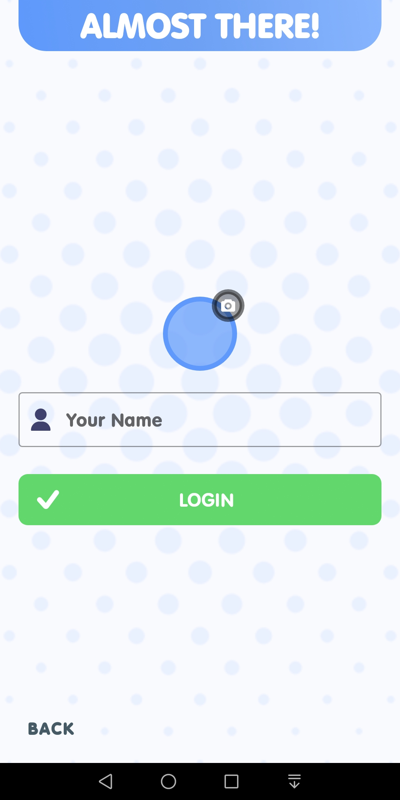</td>
      <td>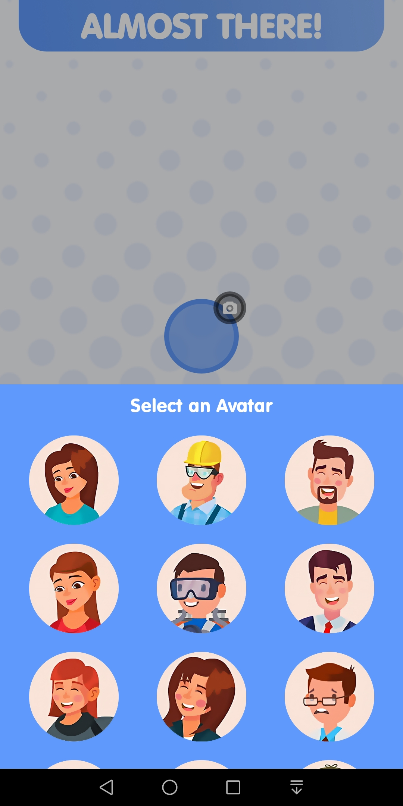</td>
      <td>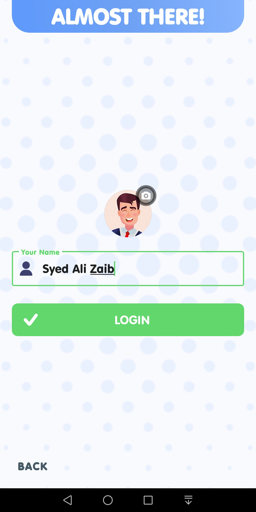</td>
  </tr>
  <tr>
      <td></td>
      <td></td>
      <td>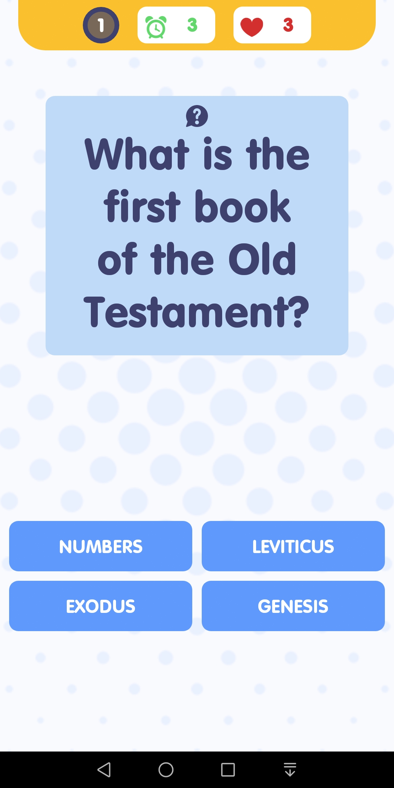</td>
  </tr>
  <tr>
      <td>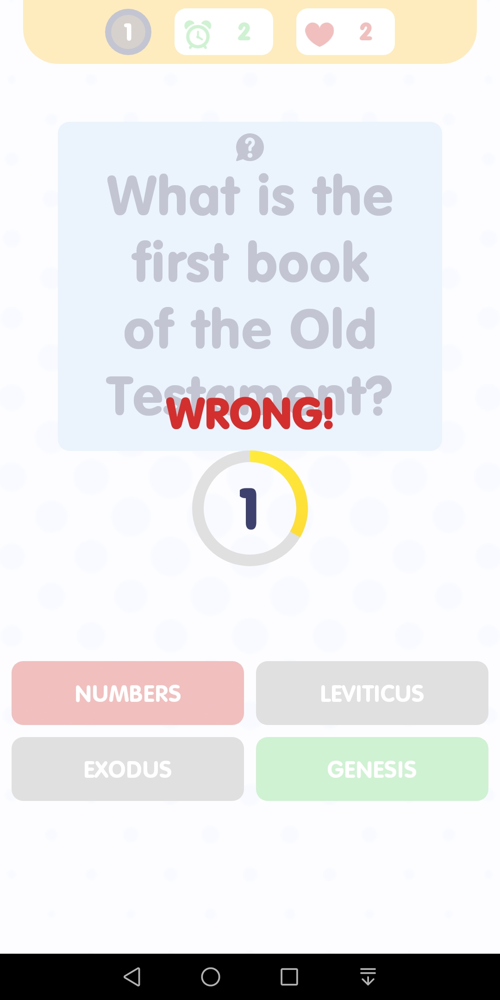</td>
      <td></td>
      <td>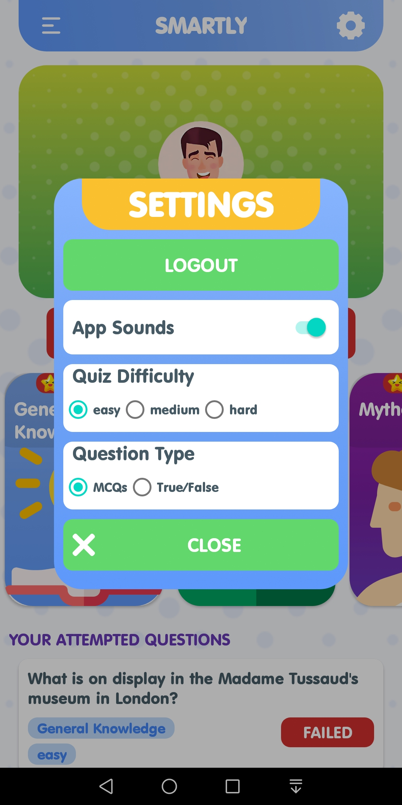</td>
  </tr>
  <tr>
      <td>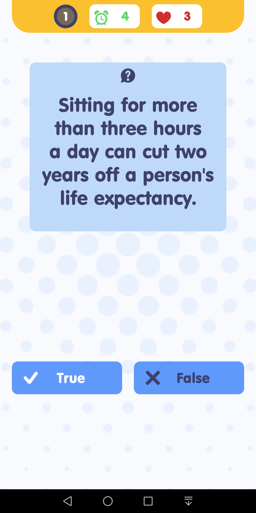</td>
      <td>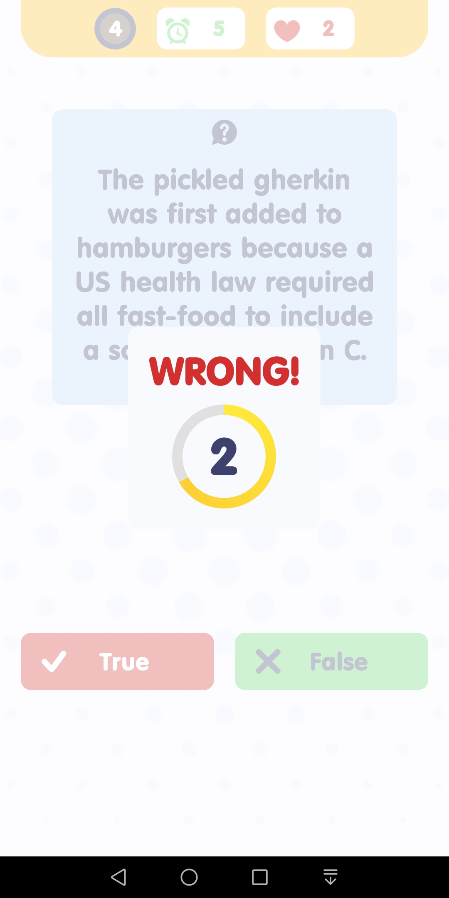</td>
      <td>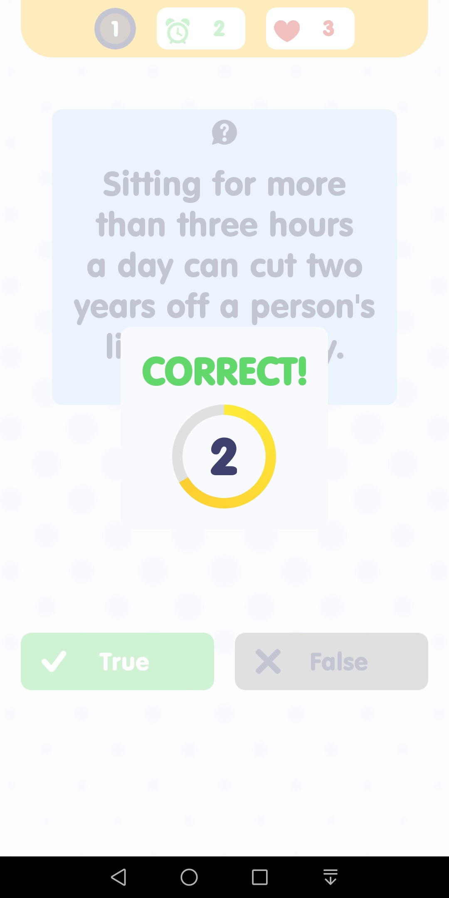</td>
  </tr>
  
  </table>

# Thanks
